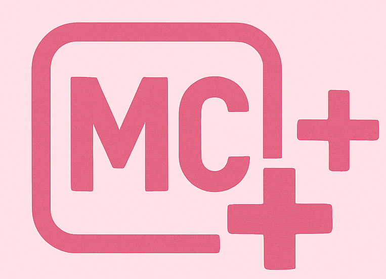

# MC ++
>A seguir está o passo a passo para conseguir utilizar a liguagem MC++. Este projeto foi apresentado a disciplina de Compiladores, ministrada pelo professor Diego Rocha, como requisito parcial para obtenção de nota. A linguagem está completa, feita a construção da linguagem léxica, sintática e semântica.

O interpretador foi desenvolvido utilizando as ferramentas Flex para a análise léxica e Bison para a análise sintática. O código-fonte  é analisado, traduzido para uma Árvore de Sintaxe Abstrata (AST).



## Tipos de Dados e Atribuir Valores:

```sh
int: Números inteiros
```
```sh
float: Números de ponto flutuante (são sempre formatados com duas casas decimais em operações aritméticas)
```
```sh
string: Texto, que é tratado como um vetor de caracteres, permitindo acesso a caracteres individuais
```
```sh
vector<tipo>: Vetores de int, float ou string
```

EXEMPLO:
```sh
int idade;
float saldo;
string nome;
vector<string> compras;

idade = 21;
saldo = 57.5;
string = "Maria";
compras = ["leite", "ovos", "pao"];
```

## Estruturas de Controle:

```sh
Condicional: if (...) { ... } else { ... }
```
```sh
Repetição: while (...) { ... }
```

## Operações:

```sh
Aritméticas: Adição (+), Subtração (-), Multiplicação (*), Divisão (/) e Potência (^)
```
```sh
Relacionais: Igual a (==), Diferente de (!=), Menor que (<),
Menor ou igual a (<=), Maior que (>), Maior ou igual a (>=).
```
```sh
Lógicas: E (&&), Ou (||), NOT (!).
```
```sh
Comentários de linha: (//)
```
```sh
Comentários de bloco: (/*...*/)
```

EXEMPLO:
```sh
int i;
int a;
a=1;
i=10;
while (i >= 0) {
    a = a * 2;
    i = i - 1;
}
```
```sh
int a;
int b;
int resultado;
a = 5;
b = 2;
resultado = (a * 10) + (b ^ 3);
if (resultado > 50) {
    print "   -> Verdadeiro, o resultado e maior que 50.";
} else {
    print "   -> Falso.";
}
```
```sh
int a;
int b;
a = 1; 
b = 0;

if (a && b) 
{
    write "Verdadeiro";
} 
else 
{
    write "Falso"; // Saída esperada
}

if (a || b) 
{
    write "Verdadeiro"; // Saída esperada
} 
else 
{
    write "Falso";
}

if (!b) 
{
    write "Verdadeiro"; // Saída esperada
} else 
{
    write "Falso";
}

//comentário de linha
/*comentario de bloco*/
```
```sh
//Colocar o (-) na frente do número, inverte seu valor.
write "Testando o inverter o sinal: 10 para -10";
int negativo;
negativo = 10;
write negativo; //10
write -negativo; //-10
```

## Entrada e Saída:

```sh
read <variável>;: Lê um valor do teclado e armazena-o na variável.
```
```sh
write <expressão>;: Escreve o valor de uma expressão, variável ou texto na tela COM /n no final.
```
```sh
print <expressão>;: Escreve o valor de uma expressão, variável ou texto na tela SEM /n no final.
```
```sh
'<3;': Adiciona um /n.
```
EXEMPLO:
```sh
int idade;
write "Digite a sua idade:";
read idade;
print "Voce tem ";
print idade;
write " anos.";
<3;
```

## Manipular vetores e strings:

```sh
Acesso a Elementos: minha_variavel[i]
```
```sh
Tamanho: minha_variavel.size()
```
```sh
Manipulação: minha_variavel.push(...) e minha_variavel.pop()
```
EXEMPLO:
```sh
vector<string> compras;
compras.push("arroz");
compras.push("feijao");
compras.push("batata");
print "Sua lista de compras inicial: ";
write compras;
print "Tamanho da lista:";
write compras.size();
compras.pop();
print "Sua lista de compras nova: ";
write compras;
```
## Questões Testadas:
We're Competing :
```sh
https://codeforces.com/gym/105962/problem/B
```
Uno :
```sh
https://codeforces.com/group/kZPk3ZTzR5/contest/100979/attachments/download/4289/maratona-mineira-2015-en.pdf
```

## Como compilar:
Apagar os anteriores:
```sh
rm -f mc.tab.* lex.yy.c
```
```sh
bison -d mc.y
```
```sh
flex mc.l
```
```sh
g++ -no-pie -std=c++11 -o mc main.cpp mc.tab.c lex.yy.c -Wall
```


